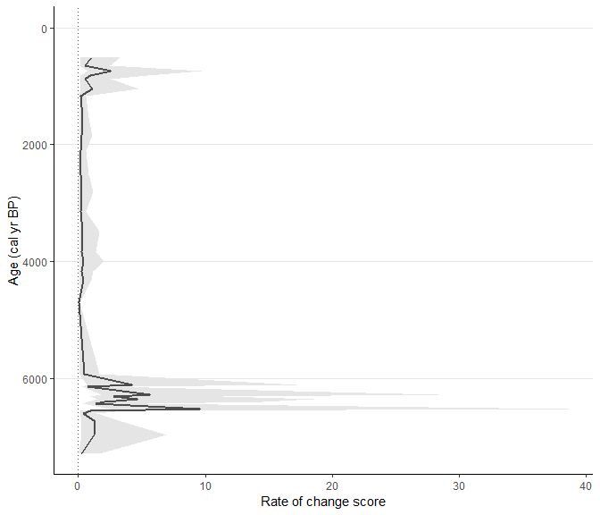
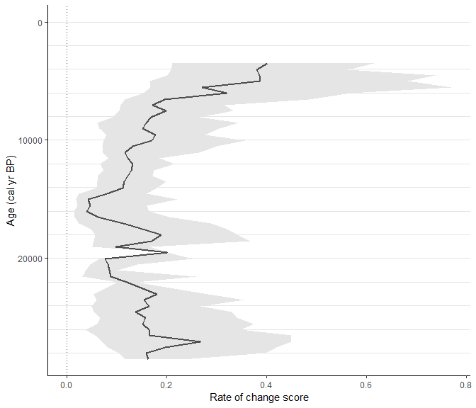
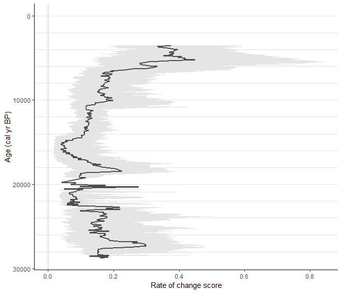
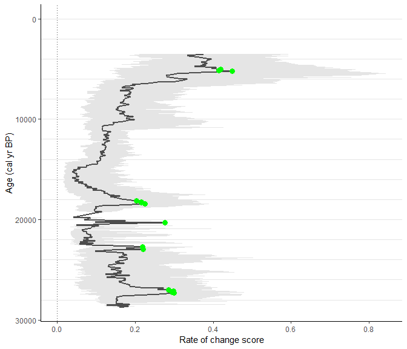

This workflow should show the full strength of the [*RRatepol package*](https://hope-uib-bio.github.io/R-Ratepol-package/) and serve as step-by-step guidance starting from downloading dataset from Neotoma, building age-depth models, to estimating rate-of-change using age uncertainty.

:warning: **This workflow is only meant as an example**: There are several additional steps for data reparation which should be done to really use the data from Neotoma!

## Install packages


Make a list of packages needed from CRAN


```r
package_list <-
  c(
    "tidyverse", # general data wrangling and visualisation
    "pander", # nice tables
    "Bchron", # age-depth modelling
    "janitor", # string cleaning
    "remotes" # installing packages from GitHub
  )
```

Install all packages from CRAN using the `{renv}` package


```r
lapply(
  package_list, renv::use
)
```

Install packages from GitHub


```r
# Install R-Ratepol
remotes::install_github("HOPE-UIB-BIO/R-Ratepol-package")

# Install neotoma2
remotes::install_github("NeotomaDB/neotoma2")
```

## Attach packages


```r
library(tidyverse) # general data wrangling and visualisation
library(pander) # nice tables
library(RRatepol) # rate-of-vegetation change
library(neotoma2) # obtain data from the Neotoma database
library(Bchron) # age-depth modeling
library(janitor) # string cleaning
```


## Download a dataset from Neotoma

Here we have selected the **XXX** record.


```r
sel_dataset_download <-
  neotoma2::get_downloads(52995)
```

## Prepare the pollen counts


```r
# get samples
sel_counts <-
  neotoma2::samples(sel_dataset_download)

# select only "pollen" taxa
sel_taxon_list_selected <-
  neotoma2::taxa(sel_dataset_download) %>%
  dplyr::filter(element == "pollen") %>%
  purrr::pluck("variablename")

# prepare taxa table
sel_counts_selected <-
  sel_counts %>%
  as.data.frame() %>%
  dplyr::mutate(sample_id = as.character(sampleid)) %>%
  tibble::as_tibble() %>%
  dplyr::select("sample_id", "value", "variablename") %>%
  # only include selected taxons
  dplyr::filter(
    variablename %in% sel_taxon_list_selected
  ) %>%
  # tunr into the wider format
  tidyr::pivot_wider(
    names_from = "variablename",
    values_from = "value",
    values_fill = 0
  ) %>%
  # clean names
  janitor::clean_names()

head(sel_counts_selected)[, 1:5]
```


------------------------------------------------------
 sample_id   montia   acaena   limosella   ranunculus 
----------- -------- -------- ----------- ------------
  538999       2        3          4           9      

  539004       0        6          0           1      

  539000       0        1          1           1      

  539001       0        1          4           3      

  539002       0        3          0           1      

  539003       0        6          0           3      
------------------------------------------------------

Here, we strongly advocate that attention should be paid to the section of the ecological group, as well, as the harmonisation of the pollen taxa. However, that is not the subject of this workflow.

We can now try to visualise the taxa per sample_id


```r
sel_counts_selected %>%
  tibble::rowid_to_column("ID") %>%
  tidyr::pivot_longer(
    cols = -c(sample_id, ID),
    names_to = "taxa",
    values_to = "n_grains"
  ) %>%
  ggplot2::ggplot(
    mapping = ggplot2::aes(
      x = ID,
      y = n_grains,
      fill = taxa
    ),
  ) +
  ggplot2::geom_bar(
    stat = "identity",
    position = "fill"
  ) +
  ggplot2::labs(
    x = "sample_id",
    y = "proportion of pollen grains"
  ) +
  ggplot2::theme(
    axis.text.x = ggplot2::element_blank(),
    legend.position = "bottom"
  )
```

<!-- -->

## Preparation of the levels

### Sample depth

Extract depth for each level


```r
sel_level <-
  neotoma2::samples(sel_dataset_download) %>%
  tibble::as_tibble() %>%
  dplyr::mutate(sample_id = as.character(sampleid)) %>%
  dplyr::distinct(sample_id, depth) %>%
  dplyr::relocate(sample_id)

head(sel_level)
```


-------------------
 sample_id   depth 
----------- -------
  538999       5   

  539004      18   

  539000      28   

  539001      38   

  539002      45   

  539003      58   
-------------------

### Age-depth modelling

We will recalculate the age-depth model 'de novo' using the [*Bchron* package](http://andrewcparnell.github.io/Bchron/). 

#### Prepare chron.control table and run Bchron
The chronology control table contains all the dates (mostly radiocarbon) to create the age-depth model.

Here we only present a few of the important steps of preparation of the chronology control table. There are many more potential issues, but solving those is not the focus of this workflow.


```r
# First, get the chronologies and check which we want to use used
sel_chron_control_table_download <-
  neotoma2::chroncontrols(sel_dataset_download)

print(sel_chron_control_table_download)
```

----------------------------------------------------------------------------
 siteid   chronologyid   depth   thickness   agelimitolder   chroncontrolid 
-------- -------------- ------- ----------- --------------- ----------------
 28408       37707        70        10           1455            115792     

 28408       37707        345       10           5970            115795     

 28408       37707       172.5      15           4210            115793     

 28408       37707        358       10           6060            115796     

 28408       37707       287.5      15           5759            115794     
----------------------------------------------------------------------------

Table: Table continues below

 
------------------------------------------------------
 agelimityounger   chroncontrolage   chroncontroltype 
----------------- ----------------- ------------------
      1105              1280           Radiocarbon    

      5830              5900           Radiocarbon    

      4070              4140           Radiocarbon    

      5920              5990           Radiocarbon    

      5139              5449           Radiocarbon    
------------------------------------------------------


```r
# prepare the table
sel_chron_control_table <-
  sel_chron_control_table_download %>%
  # Here select the ID of one of the chronology
  dplyr::filter(chronologyid == 37707) %>%
  tibble::as_tibble() %>%
  # Here we calculate the error as the average of the age `limitolder` and
  #   `agelimityounger`
  dplyr::mutate(
    error = round((agelimitolder - agelimityounger) / 2)
  ) %>%
  # As Bchron cannot accept a error of 0, we need to replace the value with 1
  dplyr::mutate(
    error = replace(error, error == 0, 1),
    error = ifelse(is.na(error), 1, error)
  ) %>%
  # We need to specify which calibration curve should be used for what point
  dplyr::mutate(
    curve = ifelse(as.data.frame(sel_dataset_download)["lat"] > 0, "intcal20", "shcal20"),
    curve = ifelse(chroncontroltype != "Radiocarbon", "normal", curve)
  ) %>%
  tibble::column_to_rownames("chroncontrolid") %>%
  dplyr::arrange(depth) %>%
  dplyr::select(
    chroncontrolage, error, depth, thickness, chroncontroltype, curve
  )

head(sel_chron_control_table)
```


--------------------------------------------------------------------------
 chroncontrolage   error   depth   thickness   chroncontroltype    curve  
----------------- ------- ------- ----------- ------------------ ---------
      1280          175     70        10         Radiocarbon      shcal20 

      4140          70     172.5      15         Radiocarbon      shcal20 

      5449          310    287.5      15         Radiocarbon      shcal20 

      5900          70      345       10         Radiocarbon      shcal20 

      5990          70      358       10         Radiocarbon      shcal20 
--------------------------------------------------------------------------

In this just a toy example we will use only the iteration multiplier (`i_multiplier`) of `0.1` to reduce the computation time. However, we strongly recommend increasing it to 5 for any normal age-depth model construction.

```r
i_multiplier <- 0.1 # increase to 5

# Those are default values suggested by the Bchron package
n_iteration_default <- 10e3
n_burn_default <- 2e3
n_thin_default <- 8

# Let's multiply them by our i_multiplier
n_iteration <- n_iteration_default * i_multiplier
n_burn <- n_burn_default * i_multiplier
n_thin <- max(c(1, n_thin_default * i_multiplier))

# run Bchron
sel_bchron <-
  Bchron::Bchronology(
    ages = sel_chron_control_table$chroncontrolage,
    ageSds = sel_chron_control_table$error,
    positions = sel_chron_control_table$depth,
    calCurves = sel_chron_control_table$curve,
    positionThicknesses = sel_chron_control_table$thickness,
    iterations = n_iteration,
    burn = n_burn,
    thin = n_thin
  )
```

Visually check the age-depth models


```r
plot(sel_bchron)
```

<!-- -->

#### Predict ages

Let's first extract posterior ages from the age-depth model (i.e. possible ages)


```r
age_position <-
  Bchron:::predict.BchronologyRun(object = sel_bchron, newPositions = sel_level$depth)

age_uncertainties <-
  age_position %>%
  as.data.frame() %>%
  dplyr::mutate_all(., as.integer) %>%
  as.matrix()

colnames(age_uncertainties) <- sel_level$sample_id

head(age_uncertainties, n = 8)[, 1:8]
```


-----------------------------------------------------------------------
 538999   539004   539000   539001   539002   539003   539006   539005 
-------- -------- -------- -------- -------- -------- -------- --------
  1206     1243     1271     1298     1318     1354     1382     2269  

  562      666      746      851      969      1187     1354     1751  

  729      852      947      1050     1147     1328     1467     2098  

  249      311      359      406      440      507      1314     1797  

  1038     1100     1310     1362     1399     1470     1626     2028  

  1613     1639     1830     1858     1964     2077     2110     2540  

  1441     1654     1785     1895     1942     2000     2104     2474  

  1484     1599     1708     1841     2025     2256     2323     2943  
-----------------------------------------------------------------------
We can visualise those "possible ages"


```r
data_age_uncertainties <-
  age_uncertainties %>%
  as.data.frame() %>%
  tibble::rowid_to_column("ID") %>%
  tidyr::pivot_longer(
    cols = -ID,
    names_to = "sample_id",
    values_to = "age"
  ) %>%
  dplyr::left_join(
    sel_level,
    by = dplyr::join_by(sample_id)
  )
```

Each line is a single potential age-depth result


```r
(
  fig_age_uncertainties <-
    data_age_uncertainties %>%
    ggplot2::ggplot(
      mapping = ggplot2::aes(
        x = age,
        y = depth
      )
    ) +
    ggplot2::geom_line(
      mapping = ggplot2::aes(
        group = ID
      ),
      alpha = 0.05,
      linewidth = 0.1
    )
)
```

<!-- -->

We can visualise the result as the range of values, each line representing one depth in our data


```r
data_age_uncertainties %>%
  ggplot2::ggplot(
    mapping = ggplot2::aes(
      x = age,
      y = depth,
      group = depth
    )
  ) +
  ggplot2::geom_hline(
    yintercept = sel_level$depth,
    lty = 2,
    color = "gray50"
  ) +
  ggplot2::geom_boxplot()
```

<!-- -->

Let's take the median age of all possibilities as our default


```r
sel_level_predicted <-
  sel_level %>%
  dplyr::mutate(
    age = apply(
      age_uncertainties, 2,
      stats::quantile,
      probs = 0.5
    )
  )

head(sel_level_predicted)
```


---------------------------
 sample_id   depth    age  
----------- ------- -------
  538999       5      423  

  539004      18     568.5 

  539000      28     682.5 

  539001      38     778.5 

  539002      45      845  

  539003      58     991.5 
---------------------------

We can visualise that by drawing a red line


```r
fig_age_uncertainties +
  ggplot2::geom_point(
    data = sel_level_predicted,
    color = "red",
    size = 3
  ) +
  ggplot2::geom_line(
    data = sel_level_predicted,
    color = "red",
    size = 1
  )
```

<!-- -->

### Visualisation of our data

Let's make a simple pollen diagram with proportions of pollen taxa


```r
sel_counts_selected %>%
  tibble::column_to_rownames("sample_id") %>%
  RRatepol:::fc_transfer_into_proportions() %>%
  tibble::rownames_to_column("sample_id") %>%
  dplyr::inner_join(
    sel_level_predicted,
    by = dplyr::join_by(sample_id)
  ) %>%
  tidyr::pivot_longer(
    cols = -c(sample_id, depth, age),
    names_to = "taxa",
    values_to = "proportion_of_grains"
  ) %>%
  ggplot2::ggplot(
    mapping = ggplot2::aes(
      y = age,
      x = proportion_of_grains,
      xmax = proportion_of_grains,
      xmin = 0,
      fill = taxa,
      col = taxa
    ),
  ) +
  ggplot2::geom_ribbon() +
  ggplot2::scale_y_continuous(trans = "reverse") +
  ggplot2::scale_x_continuous(breaks = c(0, 1)) +
  ggplot2::facet_wrap(~taxa, nrow = 1) +
  ggplot2::theme(
    legend.position = "none"
  )
```

<!-- -->


## Estimation Rate-of-Change

Here we use the prepared data to estimate the rate of vegetation change.
We will present several scenarios based on the available data. For all scenarios, we will be using the `chisq` dissimilarity coefficient (works best for pollen data), and `time_standardisation` == 500 (this means that all ROC values are 'change per 500 yr').

### Scenario - levels

"Classic" approach with individual levels.


```r
scenario_1 <-
  RRatepol::fc_estimate_RoC(
    data_source_community = sel_counts_selected,
    data_source_age = sel_level_predicted,
    DC = "chisq",
    time_standardisation = 500,
    Working_Units = "levels" # here is set to use individual levels
  )
```


```r
RRatepol::fc_plot_RoC_sequence(data_source = scenario_1)
```

<!-- -->

### Scenario - levels - smoothing

We will use the same setting as before but now add smoothing of the pollen data before analyses. Specifically, we will add `smooth_method` = "shep" (i.e. Shepard's 5-term filter).


```r
scenario_2 <-
  RRatepol::fc_estimate_RoC(
    data_source_community = sel_counts_selected,
    data_source_age = sel_level_predicted,
    DC = "chisq",
    time_standardisation = 500,
    Working_Units = "levels",
    smooth_method = "shep" # Shepard's 5-term filter
  )
```


```r
RRatepol::fc_plot_RoC_sequence(data_source = scenario_2)
```

<!-- -->

We see that the pattern changed only slightly but the absolute values changed. 

### Scenario - levels - subsampling

We will now add taxa- standardization by random sub-sampling to 150 pollen grains in each level.
In order to do that we need to increase the number of randomisations. This is again a toy example for a quick computation and we would recommend increasing the *set_randomisations* to 10.000 for any real estimation. 


```r
set_randomisations <- 100
```


```r
scenario_3 <-
  RRatepol::fc_estimate_RoC(
    data_source_community = sel_counts_selected,
    data_source_age = sel_level_predicted,
    DC = "chisq",
    Working_Units = "levels",
    time_standardisation = 500,
    smooth_method = "shep",
    standardise = TRUE, # set the taxa standardisation
    N_individuals = 150, # set the number of pollen grains
    rand = set_randomisations
  )
```

We will now also obtain a grey shadow, which is indicating uncertainty


```r
RRatepol::fc_plot_RoC_sequence(data_source = scenario_3)
```

<!-- -->

### Scenario - levels - age uncertainty

Now we will add the age uncertainty. For each iteration, the package will randomly select one age sequence from the uncertainty matrix.


```r
scenario_4 <-
  RRatepol::fc_estimate_RoC(
    data_source_community = sel_counts_selected,
    data_source_age = sel_level_predicted,
    DC = "chisq",
    Working_Units = "levels",
    time_standardisation = 500,
    smooth_method = "shep",
    standardise = TRUE,
    N_individuals = 150,
    rand = set_randomisations,
    age_uncertainty = age_uncertainties # Add the uncertainty matrix
  )
```


```r
RRatepol::fc_plot_RoC_sequence(data_source = scenario_4)
```

<!-- -->

The uncertainty around values increased drastically, this is because we are randomly sampling age and taxa with a small number of randomisations.

### Scenario - bins

In order to get rid of the effect of uneven distribution of levels, we can bin the data.
Specifically, we will change the `Working_Units` to `"bins"` to select 500 years bins instead of the individual levels.
Note that one level is randomly selected as a representation of that time bin.

```r
scenario_5 <-
  RRatepol::fc_estimate_RoC(
    data_source_community = sel_counts_selected,
    data_source_age = sel_level_predicted,
    DC = "chisq",
    Working_Units = "bins", # change the "bins"
    bin_size = 500, # sie of a time bin
    time_standardisation = 500,
    smooth_method = "shep",
    standardise = TRUE,
    N_individuals = 150,
    rand = set_randomisations,
    age_uncertainty = age_uncertainties
  )
```


```r
RRatepol::fc_plot_RoC_sequence(data_source = scenario_5)
```

<!-- -->

We see that we lost a lot of temporal precision and the uncertainty around each point is high. 

### Scenario - Mowing window

In order to gain back the temporal resolution, we can apply our novel approach of "moving window". 


```r
scenario_6 <-
  RRatepol::fc_estimate_RoC(
    data_source_community = sel_counts_selected,
    data_source_age = sel_level_predicted,
    DC = "chisq",
    Working_Units = "MW", # change the "MW" to apply the "moving window"
    bin_size = 500,
    Number_of_shifts = 5, # number of shifts
    time_standardisation = 500,
    smooth_method = "shep",
    standardise = TRUE,
    N_individuals = 150,
    rand = set_randomisations,
    age_uncertainty = age_uncertainties
  )
```


```r
RRatepol::fc_plot_RoC_sequence(data_source = scenario_6)
```

<!-- -->

### Detect peak-points

We will detect significant increase of RoC values (i.e. *peak-points*).
Specifically, we will use "Non-linear" method, which will detect significant change from a non-linear trend of RoC


```r
scenario_6_peak <-
  RRatepol::fc_detect_peak_points(
    data_source = scenario_6,
    sel_method = "trend_non_linear"
  )
```

Plot the estimates with showing both the peak-points.


```r
RRatepol::fc_plot_RoC_sequence(
  data_source = scenario_6_peak,
  Peaks = TRUE,
  trend = "trend_non_linear"
)
```

<!-- -->
