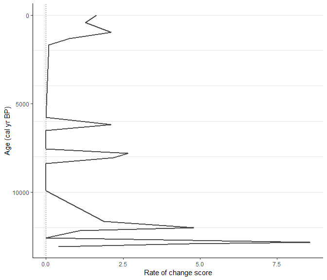

This workflow should show full strength of *RRatepol package* and serve as step by  step guidance starting from downloading dataset from Neotoma, building age-depth models, to estimating rate-of-change using age uncertainty.

:warning: **This workflow is only meant as example**: There are several additional steps for data reparation which should be done to really use the data from Neotoma!

## Install packages


Make a list of packages needed to from CRAN


```r
package_list <-
  c(
    "tidyverse", # general data wrangling and visualisation
    "pander", # nice tables
    "Bchron", # age-depth modeling
    "janitor", # string cleaning
    "remotes" # installing packages from GitHub
  )
```

Install all packages from CRAN using `{renv}` package


```r
lapply(
  package_list, renv::use
)
```

Install packages from GitHub


```r
# Install R-Ratepol
remotes::install_github("HOPE-UIB-BIO/R-Ratepol-package")

# Install neotoma2
remotes::install_github("NeotomaDB/neotoma2")
```

## Attach packages


```r
library(tidyverse) # general data wrangling and visualisation
library(pander) # nice tables
library(RRatepol) # rate-of-vegetation change
library(neotoma2) # obtain data from Neotoma database
library(Bchron) # age-depth modeling
library(janitor) # string cleaning
```


## Download a dataset from Neotoma

Here we have selected the **XXX** record.


```r
sel_dataset_download <-
  neotoma2::get_downloads(52406)

sel_chron_control_table_download <-
  neotoma2::chroncontrols(sel_dataset_download)
```

## Prepare the pollen counts


```r
sel_counts <-
  neotoma2::samples(sel_dataset_download)

sel_taxon_list_selected <-
  neotoma2::taxa(sel_dataset_download) %>%
  dplyr::filter(element == "pollen") %>%
  purrr::pluck("variablename")

sel_counts_selected <-
  sel_counts %>%
  as.data.frame() %>%
  dplyr::mutate(sample_id = as.character(sampleid)) %>%
  tibble::as_tibble() %>%
  dplyr::select("sample_id", "value", "variablename") %>%
  dplyr::filter(
    variablename %in% sel_taxon_list_selected
  ) %>%
  tidyr::pivot_wider(
    names_from = "variablename",
    values_from = "value",
    values_fill = 0
  ) %>%
  janitor::clean_names()

head(sel_counts_selected)[, 1:5]
```


------------------------------------------------------
 sample_id   euclea   brucea   tribulus   cassia_type 
----------- -------- -------- ---------- -------------
  520307       1        0         0            0      

  520308       0        2         0            0      

  520311       0        0         3            0      

  520312       3        1         0            1      

  520313       1        0         0            1      

  520310       1        0         0            0      
------------------------------------------------------

Here, we strongly advocate that attention should be paid to the section of  ecological ecological group, as well, as harmonisation of the pollen taxa. However, that is not subject of this workflow.

## Preparation of the levels

### Sample depth

Extract depth for each level


```r
sel_level <-
  neotoma2::samples(sel_dataset_download) %>%
  tibble::as_tibble() %>%
  dplyr::mutate(sample_id = as.character(sampleid)) %>%
  dplyr::distinct(sample_id, depth) %>%
  dplyr::relocate(sample_id)

head(sel_level)
```


-------------------
 sample_id   depth 
----------- -------
  520307       0   

  520308      47   

  520311      77   

  520312      97   

  520313      120  

  520310      420  
-------------------

### Age depth modelling

We will recalculate new age-depth model 'de novo' using *Bchron* package. 

#### Prepare chron.control table and run Bchron
Chrolonogy control table contains all the dates (mostly radiocarbon) to create age-depth model.

Here we only present few of the important steps of preparation of chron.control table. There are many more potential issues issues but solving those is not  the focus of this workflow.


```r
# first check which chronologies were used
print(sel_chron_control_table_download)

# prepare the table
sel_chron_control_table <-
  sel_chron_control_table_download %>%
  # here select the ID of oe of the chronology
  dplyr::filter(chronologyid == 37274) %>%
  tibble::as_tibble() %>%
  # here we calculate the error as the avarage as the agelimitolder and
  #   agelimityounger
  dplyr::mutate(
    error = round((agelimitolder - agelimityounger) / 2)
  ) %>%
  # as Bchron cannot accept error of 0, we need to replace the value with 1
  dplyr::mutate(
    error = replace(error, error == 0, 1),
    error = ifelse(is.na(error), 1, error)
  ) %>%
  # we need to specifify which calibration curve should be used for what point
  dplyr::mutate(
    curve = ifelse(as.data.frame(sel_dataset_download)["lat"] > 0, "intcal20", "shcal20"),
    curve = ifelse(chroncontroltype != "Radiocarbon", "normal", curve)
  ) %>%
  tibble::column_to_rownames("chroncontrolid") %>%
  dplyr::arrange(depth) %>%
  dplyr::select(
    chroncontrolage, error, depth, thickness, chroncontroltype, curve
  )

head(sel_chron_control_table)
```


---------------------------------------------------------------------------
 chroncontrolage   error   depth   thickness   chroncontroltype    curve   
----------------- ------- ------- ----------- ------------------ ----------
        0            1       0         0           Core top        normal  

       360          70      47         1         Radiocarbon      intcal20 

      2879          135     198        1         Radiocarbon      intcal20 

      4300          65     357.5       1         Radiocarbon      intcal20 

      5480          50     453.5       1         Radiocarbon      intcal20 

      8400          70     691.5       1         Radiocarbon      intcal20 
---------------------------------------------------------------------------

In this  toy example we will use only iteration multiplier (*i_multiplier*) of 0.1 to  reduce the computation time. However, we strongly recommend to increase it to 5 for any normal age-depth model construction.

```r
i_multiplier <- 0.1 # increase to 5

# those are default values suggested by the bchron package
n_iteration_default <- 10e3
n_burn_default <- 2e3
n_thin_default <- 8

# lets multiply them by our i_multiplier
n_iteration <- n_iteration_default * i_multiplier
n_burn <- n_burn_default * i_multiplier
n_thin <- max(c(1, n_thin_default * i_multiplier))

# run bchron
sel_bchron <-
  Bchron::Bchronology(
    ages = sel_chron_control_table$chroncontrolage,
    ageSds = sel_chron_control_table$error,
    positions = sel_chron_control_table$depth,
    calCurves = sel_chron_control_table$curve,
    positionThicknesses = sel_chron_control_table$thickness,
    iterations = n_iteration,
    burn = n_burn,
    thin = n_thin
  )
```

Visualy check the age-depth models


```r
plot(sel_bchron)
```

<!-- -->

#### Predict ages

Let's firts extract posterion ages from the age-depth model (i.e. possible ages)


```r
age_position <-
  Bchron:::predict.BchronologyRun(object = sel_bchron, newPositions = sel_level$depth)

age_uncertainties <-
  age_position %>%
  as.data.frame() %>%
  dplyr::mutate_all(., as.integer) %>%
  as.matrix()

colnames(age_uncertainties) <- sel_level$sample_id

head(age_uncertainties, n = 8)[, 1:8]
```


-----------------------------------------------------------------------
 520307   520308   520311   520312   520313   520310   520309   520314 
-------- -------- -------- -------- -------- -------- -------- --------
   0       455      693      1385     1477     6216     6323     6447  

   0       455      1159     1249     1524     5638     6262     6727  

   0       455      756      916      1204     5710     6156     6696  

   0       455      510      547      860      5086     5986     6555  

   0       455      1149     1305     1372     5805     6165     6859  

   0       455      1459     1610     1784     5802     6116     6873  

   0       455      1350     1857     1958     5941     6181     6256  

   0       455      938      1040     1428     5908     6178     7394  
-----------------------------------------------------------------------
We can visualise those "possible ages"


```r
data_age_uncertainties <-
  age_uncertainties %>%
  as.data.frame() %>%
  tibble::rowid_to_column("ID") %>%
  tidyr::pivot_longer(
    cols = -ID,
    names_to = "sample_id",
    values_to = "age"
  ) %>%
  dplyr::left_join(
    sel_level,
    by = dplyr::join_by(sample_id)
  )
```

Each line is a single potential age-depth result


```r
(
  fig_age_uncertainties <-
    data_age_uncertainties %>%
    ggplot2::ggplot(
      mapping = ggplot2::aes(
        x = age,
        y = depth
      )
    ) +
    ggplot2::geom_line(
      mapping = ggplot2::aes(
        group = ID
      ),
      alpha = 0.05,
      linewidth = 0.1
    )
)
```

<!-- -->

We can visualise the result as range of the values, each line represent one depth in our data


```r
data_age_uncertainties %>%
  ggplot2::ggplot(
    mapping = ggplot2::aes(
      x = age,
      y = depth,
      group = depth
    )
  ) +
  ggplot2::geom_hline(
    yintercept = sel_level$depth,
    lty = 2,
    color = "gray50"
  ) +
  ggplot2::geom_boxplot()
```

<!-- -->

Let's take the median age of all possibilities as our default


```r
sel_level_predicted <-
  sel_level %>%
  dplyr::mutate(
    age = apply(
      age_uncertainties, 2,
      stats::quantile,
      probs = 0.5
    )
  )

head(sel_level_predicted)
```


--------------------------
 sample_id   depth   age  
----------- ------- ------
  520307       0      1   

  520308      47     426  

  520311      77     933  

  520312      97     1262 

  520313      120    1655 

  520310      420    5771 
--------------------------

We can visualise that by drawing a red line


```r
fig_age_uncertainties +
  ggplot2::geom_point(
    data = sel_level_predicted,
    color = "red",
    size = 3
  ) +
  ggplot2::geom_line(
    data = sel_level_predicted,
    color = "red",
    size = 1
  )
```

<!-- -->

## Estimation Rate-of-Change

Here we use the the prepared data to estimate the rate of vegetation change. We
will use the method of the *binning with the mowing window*, *Shepard's 5-term filter* 
as data smoothing *Chi-squared coefficient* as dissimilarity coefficient.
This is again a toy example for a quick computation and we would recommend 
increasing the *randomisations* to 10.000 for any real estimation. 


```r
sel_roc <-
  RRatepol::fc_estimate_RoC(
    data_source_community = sel_counts_selected,
    data_source_age = sel_level_predicted,
    smooth_method = "none",
    DC = "chisq",
    Working_Units = "levels",
    standardise = FALSE
  )
```


```r
RRatepol::fc_plot_RoC_sequence(
  data_source = sel_roc
)
```

<!-- -->


