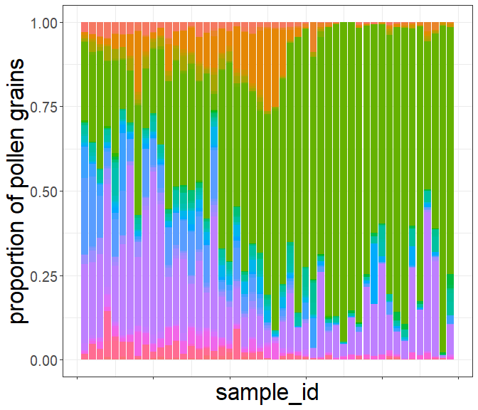

This workflow should show full strength of *RRatepol package* and serve as step by  step guidance starting from downloading dataset from Neotoma, building age-depth models, to estimating rate-of-change using age uncertainty.

:warning: **This workflow is only meant as example**: There are several additional steps for data reparation which should be done to really use the data from Neotoma!

## Install packages


Make a list of packages needed to from CRAN


```r
package_list <-
  c(
    "tidyverse", # general data wrangling and visualisation
    "pander", # nice tables
    "Bchron", # age-depth modeling
    "janitor", # string cleaning
    "remotes" # installing packages from GitHub
  )
```

Install all packages from CRAN using `{renv}` package


```r
lapply(
  package_list, renv::use
)
```

Install packages from GitHub


```r
# Install R-Ratepol
remotes::install_github("HOPE-UIB-BIO/R-Ratepol-package")

# Install neotoma2
remotes::install_github("NeotomaDB/neotoma2")
```

## Attach packages


```r
library(tidyverse) # general data wrangling and visualisation
library(pander) # nice tables
library(RRatepol) # rate-of-vegetation change
library(neotoma2) # obtain data from Neotoma database
library(Bchron) # age-depth modeling
library(janitor) # string cleaning
```


## Download a dataset from Neotoma

Here we have selected the **XXX** record.


```r
sel_dataset_download <-
  neotoma2::get_downloads(52995)
```

## Prepare the pollen counts


```r
# get samples
sel_counts <-
  neotoma2::samples(sel_dataset_download)

# select only "pollen" taxa
sel_taxon_list_selected <-
  neotoma2::taxa(sel_dataset_download) %>%
  dplyr::filter(element == "pollen") %>%
  purrr::pluck("variablename")

# prepare taxa table
sel_counts_selected <-
  sel_counts %>%
  as.data.frame() %>%
  dplyr::mutate(sample_id = as.character(sampleid)) %>%
  tibble::as_tibble() %>%
  dplyr::select("sample_id", "value", "variablename") %>%
  # only include selected taxons
  dplyr::filter(
    variablename %in% sel_taxon_list_selected
  ) %>%
  # tunr into wider format
  tidyr::pivot_wider(
    names_from = "variablename",
    values_from = "value",
    values_fill = 0
  ) %>%
  # clean names
  janitor::clean_names()

head(sel_counts_selected)[, 1:5]
```


------------------------------------------------------
 sample_id   montia   acaena   limosella   ranunculus 
----------- -------- -------- ----------- ------------
  538999       2        3          4           9      

  539004       0        6          0           1      

  539000       0        1          1           1      

  539001       0        1          4           3      

  539002       0        3          0           1      

  539003       0        6          0           3      
------------------------------------------------------

Here, we strongly advocate that attention should be paid to the section of  ecological ecological group, as well, as harmonisation of the pollen taxa. However, that is not subject of this workflow.

We can now try to visualise the taxa per sample_id


```r
sel_counts_selected %>%
  tibble::rowid_to_column("ID") %>%
  tidyr::pivot_longer(
    cols = -c(sample_id, ID),
    names_to = "taxa",
    values_to = "n_grains"
  ) %>%
  ggplot2::ggplot(
    mapping = ggplot2::aes(
      x = ID,
      y = n_grains,
      fill = taxa
    ),
  ) +
  ggplot2::geom_bar(
    stat = "identity",
    position = "fill"
  ) +
  ggplot2::labs(
    x = "sample_id",
    y = "proportion of pollen grains"
  ) +
  ggplot2::theme(
    axis.text.x = ggplot2::element_blank(),
    legend.position = "bottom"
  )
```

<!-- -->

## Preparation of the levels

### Sample depth

Extract depth for each level


```r
sel_level <-
  neotoma2::samples(sel_dataset_download) %>%
  tibble::as_tibble() %>%
  dplyr::mutate(sample_id = as.character(sampleid)) %>%
  dplyr::distinct(sample_id, depth) %>%
  dplyr::relocate(sample_id)

head(sel_level)
```


-------------------
 sample_id   depth 
----------- -------
  538999       5   

  539004      18   

  539000      28   

  539001      38   

  539002      45   

  539003      58   
-------------------

### Age depth modelling

We will recalculate new age-depth model 'de novo' using *Bchron* package. 

#### Prepare chron.control table and run Bchron
Chrolonogy control table contains all the dates (mostly radiocarbon) to create age-depth model.

Here we only present few of the important steps of preparation of chron.control table. There are many more potential issues issues but solving those is not  the focus of this workflow.


```r
# first get the chronologies and check which we want to use used
sel_chron_control_table_download <-
  neotoma2::chroncontrols(sel_dataset_download)

print(sel_chron_control_table_download)
```

----------------------------------------------------------------------------
 siteid   chronologyid   depth   thickness   agelimitolder   chroncontrolid 
-------- -------------- ------- ----------- --------------- ----------------
 28408       37707        70        10           1455            115792     

 28408       37707        345       10           5970            115795     

 28408       37707       172.5      15           4210            115793     

 28408       37707        358       10           6060            115796     

 28408       37707       287.5      15           5759            115794     
----------------------------------------------------------------------------

Table: Table continues below

 
------------------------------------------------------
 agelimityounger   chroncontrolage   chroncontroltype 
----------------- ----------------- ------------------
      1105              1280           Radiocarbon    

      5830              5900           Radiocarbon    

      4070              4140           Radiocarbon    

      5920              5990           Radiocarbon    

      5139              5449           Radiocarbon    
------------------------------------------------------


```r
# prepare the table
sel_chron_control_table <-
  sel_chron_control_table_download %>%
  # here select the ID of oe of the chronology
  dplyr::filter(chronologyid == 37707) %>%
  tibble::as_tibble() %>%
  # here we calculate the error as the avarage as the agelimitolder and
  #   agelimityounger
  dplyr::mutate(
    error = round((agelimitolder - agelimityounger) / 2)
  ) %>%
  # as Bchron cannot accept error of 0, we need to replace the value with 1
  dplyr::mutate(
    error = replace(error, error == 0, 1),
    error = ifelse(is.na(error), 1, error)
  ) %>%
  # we need to specifify which calibration curve should be used for what point
  dplyr::mutate(
    curve = ifelse(as.data.frame(sel_dataset_download)["lat"] > 0, "intcal20", "shcal20"),
    curve = ifelse(chroncontroltype != "Radiocarbon", "normal", curve)
  ) %>%
  tibble::column_to_rownames("chroncontrolid") %>%
  dplyr::arrange(depth) %>%
  dplyr::select(
    chroncontrolage, error, depth, thickness, chroncontroltype, curve
  )

head(sel_chron_control_table)
```


--------------------------------------------------------------------------
 chroncontrolage   error   depth   thickness   chroncontroltype    curve  
----------------- ------- ------- ----------- ------------------ ---------
      1280          175     70        10         Radiocarbon      shcal20 

      4140          70     172.5      15         Radiocarbon      shcal20 

      5449          310    287.5      15         Radiocarbon      shcal20 

      5900          70      345       10         Radiocarbon      shcal20 

      5990          70      358       10         Radiocarbon      shcal20 
--------------------------------------------------------------------------

In this  toy example we will use only iteration multiplier (*i_multiplier*) of 0.1 to  reduce the computation time. However, we strongly recommend to increase it to 5 for any normal age-depth model construction.

```r
i_multiplier <- 0.1 # increase to 5

# those are default values suggested by the bchron package
n_iteration_default <- 10e3
n_burn_default <- 2e3
n_thin_default <- 8

# lets multiply them by our i_multiplier
n_iteration <- n_iteration_default * i_multiplier
n_burn <- n_burn_default * i_multiplier
n_thin <- max(c(1, n_thin_default * i_multiplier))

# run bchron
sel_bchron <-
  Bchron::Bchronology(
    ages = sel_chron_control_table$chroncontrolage,
    ageSds = sel_chron_control_table$error,
    positions = sel_chron_control_table$depth,
    calCurves = sel_chron_control_table$curve,
    positionThicknesses = sel_chron_control_table$thickness,
    iterations = n_iteration,
    burn = n_burn,
    thin = n_thin
  )
```

Visualy check the age-depth models


```r
plot(sel_bchron)
```

<!-- -->

#### Predict ages

Let's firts extract posterion ages from the age-depth model (i.e. possible ages)


```r
age_position <-
  Bchron:::predict.BchronologyRun(object = sel_bchron, newPositions = sel_level$depth)

age_uncertainties <-
  age_position %>%
  as.data.frame() %>%
  dplyr::mutate_all(., as.integer) %>%
  as.matrix()

colnames(age_uncertainties) <- sel_level$sample_id

head(age_uncertainties, n = 8)[, 1:8]
```


-----------------------------------------------------------------------
 538999   539004   539000   539001   539002   539003   539006   539005 
-------- -------- -------- -------- -------- -------- -------- --------
   52      137      202      266      328      452      547      1284  

  783      846      895      943      977      1041     1089     1288  

  656      798      908      1018     1095     1238     1348     1749  

  334      406      649      880      987      1186     1339     1711  

  1235     1262     1283     1304     1318     1345     1366     1751  

  588      640      681      814      935      1161     1335     2595  

  1138     1184     1220     1256     1281     1327     1363     2097  

  819      845      875      921      952      1010     1074     1717  
-----------------------------------------------------------------------
We can visualise those "possible ages"


```r
data_age_uncertainties <-
  age_uncertainties %>%
  as.data.frame() %>%
  tibble::rowid_to_column("ID") %>%
  tidyr::pivot_longer(
    cols = -ID,
    names_to = "sample_id",
    values_to = "age"
  ) %>%
  dplyr::left_join(
    sel_level,
    by = dplyr::join_by(sample_id)
  )
```

Each line is a single potential age-depth result


```r
(
  fig_age_uncertainties <-
    data_age_uncertainties %>%
    ggplot2::ggplot(
      mapping = ggplot2::aes(
        x = age,
        y = depth
      )
    ) +
    ggplot2::geom_line(
      mapping = ggplot2::aes(
        group = ID
      ),
      alpha = 0.05,
      linewidth = 0.1
    )
)
```

<!-- -->

We can visualise the result as range of the values, each line represent one depth in our data


```r
data_age_uncertainties %>%
  ggplot2::ggplot(
    mapping = ggplot2::aes(
      x = age,
      y = depth,
      group = depth
    )
  ) +
  ggplot2::geom_hline(
    yintercept = sel_level$depth,
    lty = 2,
    color = "gray50"
  ) +
  ggplot2::geom_boxplot()
```

<!-- -->

Let's take the median age of all possibilities as our default


```r
sel_level_predicted <-
  sel_level %>%
  dplyr::mutate(
    age = apply(
      age_uncertainties, 2,
      stats::quantile,
      probs = 0.5
    )
  )

head(sel_level_predicted)
```


---------------------------
 sample_id   depth    age  
----------- ------- -------
  538999       5     608.5 

  539004      18      720  

  539000      28      799  

  539001      38     871.5 

  539002      45      928  

  539003      58     1040  
---------------------------

We can visualise that by drawing a red line


```r
fig_age_uncertainties +
  ggplot2::geom_point(
    data = sel_level_predicted,
    color = "red",
    size = 3
  ) +
  ggplot2::geom_line(
    data = sel_level_predicted,
    color = "red",
    size = 1
  )
```

<!-- -->

### Visualisation of our data

Lets make a simple pollen diagram with proportions of pollen taxa


```r
sel_counts_selected %>%
  tibble::column_to_rownames("sample_id") %>%
  RRatepol:::fc_transfer_into_proportions() %>%
  tibble::rownames_to_column("sample_id") %>%
  dplyr::inner_join(
    sel_level_predicted,
    by = dplyr::join_by(sample_id)
  ) %>%
  tidyr::pivot_longer(
    cols = -c(sample_id, depth, age),
    names_to = "taxa",
    values_to = "proportion_of_grains"
  ) %>%
  ggplot2::ggplot(
    mapping = ggplot2::aes(
      y = age,
      x = proportion_of_grains,
      xmax = proportion_of_grains,
      xmin = 0,
      fill = taxa,
      col = taxa
    ),
  ) +
  ggplot2::geom_ribbon() +
  ggplot2::scale_y_continuous(trans = "reverse") +
  ggplot2::scale_x_continuous(breaks = c(0, 1)) +
  ggplot2::facet_wrap(~taxa, nrow = 1) +
  ggplot2::theme(
    legend.position = "none"
  )
```

<!-- -->


## Estimation Rate-of-Change

Here we use the the prepared data to estimate the rate of vegetation change.
We will present several scenarios based on the available data. For all scenarios wr will be using `chisq` dissimilarity coeficient (works best for pollen data), and `time_standardisation` == 500 (this means that all ROC values are 'change per 500 yr').

### Scenario - levels

"Classic" approach with individual levels.


```r
scenario_1 <-
  RRatepol::fc_estimate_RoC(
    data_source_community = sel_counts_selected,
    data_source_age = sel_level_predicted,
    DC = "chisq",
    time_standardisation = 500,
    Working_Units = "levels" # here is set to use individual levels
  )
```


```r
RRatepol::fc_plot_RoC_sequence(data_source = scenario_1)
```

<!-- -->

### Scenario - levels - smoothing

We will use the same setting as before but now add smoothing of the pollen data before analyses. Specifically, we will add `smooth_method` = "shep" (i.e. Shepard's 5-term filter).


```r
scenario_2 <-
  RRatepol::fc_estimate_RoC(
    data_source_community = sel_counts_selected,
    data_source_age = sel_level_predicted,
    DC = "chisq",
    time_standardisation = 500,
    Working_Units = "levels",
    smooth_method = "shep" # Shepard's 5-term filter
  )
```

We see that the patern change only slightly but the absolute value drop to half. 


```r
RRatepol::fc_plot_RoC_sequence(data_source = scenario_2)
```

<!-- -->

### Scenario - levels - subsampling

We will now add taxa- standardization by random sub-sampling to 150 pollen grains in each level.
In order to do that we need to increase a number of randomisations. This is again a toy example for a quick computation and we would recommend increasing the *set_randomisations* to 10.000 for any real estimation. 


```r
set_randomisations <- 100
```


```r
scenario_3 <-
  RRatepol::fc_estimate_RoC(
    data_source_community = sel_counts_selected,
    data_source_age = sel_level_predicted,
    DC = "chisq",
    Working_Units = "levels",
    time_standardisation = 500,
    smooth_method = "shep",
    standardise = TRUE, # set the taxa standardisation
    N_individuals = 150, # set the number of pollen grains
    rand = set_randomisations
  )
```

We will now also obtain a gray shadow, which is indicating uncertainty


```r
RRatepol::fc_plot_RoC_sequence(data_source = scenario_3)
```

<!-- -->


